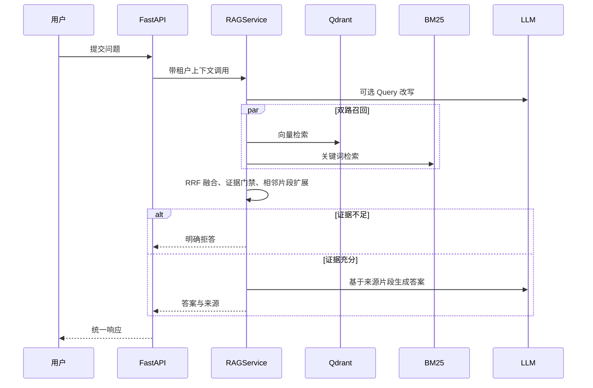
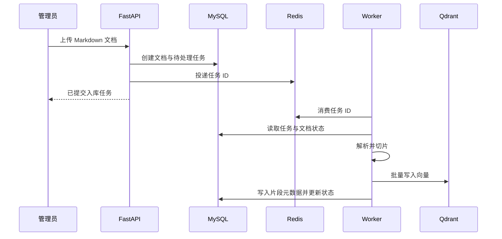

# 系统架构概览

## 项目定位

`smart-qa-system` 是一个 Python 企业知识库问答与 Agent 学习项目。RAG 是当前稳定主链路；Agent、Multi-Agent、Prompt 管理和 LLM 评测属于独立学习模块，后续通过真实业务入口、调用审计和回归数据逐项升级，而不与主链路强耦合。

## 组件职责

| 组件 | 职责 | 失败时的行为 |
| --- | --- | --- |
| FastAPI App | 鉴权、知识库 API、问答 API、评测 API | 返回统一错误响应，不直接暴露内部异常 |
| Redis | 文档异步任务队列、BM25 刷新通知、缓存 | 入库任务不确认成功；问答缓存降级为直查 |
| Worker | 文档解析、切片、向量写入、MySQL 状态更新 | 任务标记失败并保留错误信息，后续实现人工重试 |
| MySQL | 文档、片段、任务、评测运行及逐题结果 | 作为业务状态的事实来源 |
| Qdrant | 向量检索与同文档相邻片段查询 | 问答拒绝服务，不生成无证据回答 |
| BM25 | 关键词召回 | 不可用时由监控暴露问题；不能把它伪装成已成功的混合检索 |
| DeepSeek API | Query 改写、证据判定、答案生成 | 超时或异常时返回受控错误，不以猜测替代答案 |
| Agent 学习模块 | Tool Calling、状态机、路由、多 Agent 协作与记忆；知识运营 Agent 提供受控只读工具 | 不影响 RAG 主链路；知识运营工具使用 Pydantic 校验、租户隔离与操作审计，其他未完成评测的模块不作为生产能力宣称 |

## 提问链路

## 文档入库链路

当前状态机为 `PENDING -> RUNNING -> COMPLETED / RETRYING / FAILED`。重复消息通过数据库条件领取锁消除；Qdrant 使用稳定 Point ID 覆盖写入；最终失败任务可由管理员人工重试。具体取舍见[文档入库可靠性设计](document-ingestion-reliability.md)。

## 评测链路

题库评测执行真实 RAG 链路，记录来源召回、事实覆盖、拒答正确性和耗时。每次运行都保存 Git 提交、题库校验和、检索配置快照及逐题明细；趋势比较只选择相同题库、相同题量的历史基线，避免错误比较。
