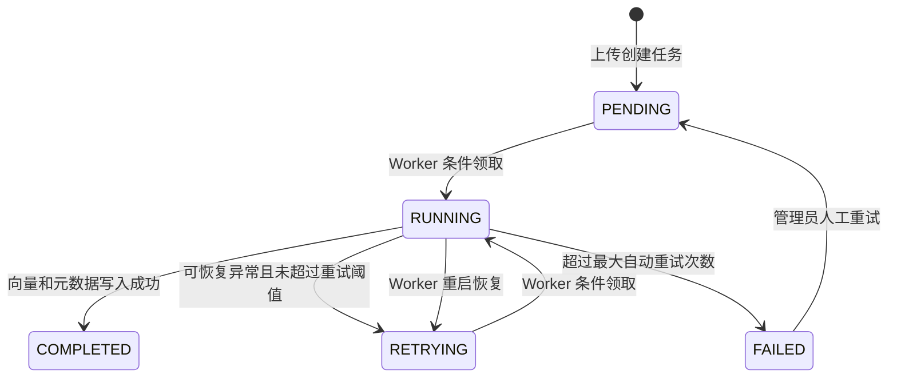

# 文档入库可靠性设计

## 问题与边界

上传接口只负责保存原文件、文档记录与入库任务；解析、切片和向量化由 Redis 队列后的 Worker 执行。这样 HTTP 请求不会被模型加载或大文件处理阻塞，但会引入重复消息、Worker 中断和 MySQL/Qdrant 跨存储不一致的问题。

## 状态机

## 幂等策略

1. 队列消息仅携带 `task_id`，MySQL 的任务状态是业务事实来源。
2. Worker 使用 `UPDATE ... WHERE status IN ('PENDING', 'RETRYING')` 领取任务；重复消息无法再次领取。
3. Qdrant Point ID 由 `document_id + chunk_index` 以 UUIDv5 确定性生成。重复消费执行 upsert，会覆盖同一片段而不是新增向量。
4. `kb_document_chunk` 以 `(document_id, chunk_index)` 为唯一键，元数据写入使用 UPSERT。
5. Worker 启动时将残留的 `RUNNING` 任务恢复为 `RETRYING`，并重新投递所有 `PENDING/RETRYING` 任务。队列中出现重复消息是可接受的，由数据库领取锁消除重复执行。

## 失败处理

| 故障 | 处理方式 |
| --- | --- |
| 解析或向量化异常 | 删除本次确定性 Point ID，任务计数加一，自动重试至 `DOCUMENT_TASK_MAX_RETRIES` |
| MySQL 元数据写入失败 | 删除本次向量，下一次重试覆盖写入相同 Point ID |
| Worker 容器中断 | 启动恢复 `RUNNING` 状态，并重新投递可恢复任务 |
| 达到重试上限 | 任务和文档标记为 `FAILED`，保留错误信息 |
| 人工恢复 | 管理员调用 `POST /api/v1/knowledge/tasks/{task_id}/retry`，重置为 `PENDING` 并写入审计日志 |

## 已知取舍

当前采用 Redis List + 单 Worker，适合低成本单机部署。它不提供 Kafka 级别的消费者组和延迟队列能力，但通过任务状态、条件领取和确定性写入满足本项目的至少一次投递语义。业务增长到多 Worker 或跨服务事件时，再迁移至 Redis Streams 或 Kafka，并保留 `task_id` 幂等键。
